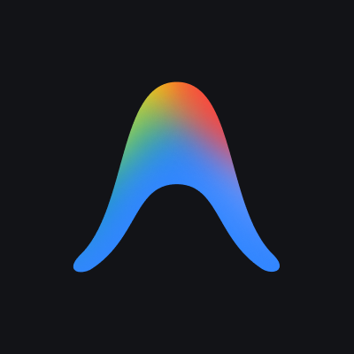

  

  <h1>Olá! Eu sou Flávia Regina</h1>
  <h3>Desenvolvedora Fullstack • Infoprodutora Digital</h3>

  
  
  

  > *Gosto de construir soluções simples, funcionais e bem estruturadas, sempre buscando evoluir como desenvolvedora.* ✨

### 👩‍💻 Sobre mim

> 🎓 Cursando **Análise e Desenvolvimento de Sistemas** (Estácio)  
> 💼 Trabalho na **Secretaria de Educação do RN (SEEC)**  
> 📦 **Infoprodutora digital**, criadora do **SimBox** (para The Sims 4)  
> 🚀 Focada em **evolução constante** no desenvolvimento de sistemas

---

### 💻 Atuação e Projetos
<table>
  <tr>
    <td width="50%" valign="top">
      <h3>✦ Shine Glam</h3>
      <b>E-commerce de Maquiagem</b> 
      Desenvolvimento de um site de vendas com estrutura completa, incluindo painel administrativo para gerenciamento de produtos, pedidos e usuários, além de painel do cliente com navegação e acompanhamento de compras.  
      
      
      
      
      
      
    </td>
    <td width="50%" valign="top">
      <h3>✦ Catálogo Fácil</h3>
      <b>SaaS de Catálogos Digitais</b> 
      Plataforma SaaS multi-tenant para criação e exibição de catálogos digitais. Possui planos Free/Pro, integração com API de pagamento (Karvis PAY) e integração com WhatsApp para contato direto.  
      
      
      
      
    </td>
  </tr>
  <tr>
    <td width="50%" valign="top">
      <h3>✦ SGMP</h3>
      <b>Sistema de Gestão e Monitoramento</b> 
      Sistema web para acompanhamento de projetos e tarefas, com cadastro de responsáveis e prazos. Inclui controle de status, perfis de acesso e histórico de atualizações em tempo real.  
      
      
      
      
      
    </td>
    <td width="50%" valign="top">
      <h3>✦ SimBox</h3>
      <b>Produto Digital</b> 
      Plataforma digital voltada para a comunidade de The Sims 4, estruturada para apresentação e distribuição de conteúdos personalizados com foco em organização e experiência do usuário intuitiva.  
      
      
      
      
    </td>
  </tr>
  <tr>
    <td width="50%" valign="top">
      <h3>✦ Protege Educ</h3>
      Projeto voltado para soluções educacionais e organização de processos internos.  
      
      
    </td>
    <td width="50%" valign="top">
      <h3>✦ Outros Projetos</h3>
      Aplicações web simples desenvolvidas para estudo, prática e consolidação de conhecimentos na área de desenvolvimento de software.  
      
    </td>
  </tr>
</table>

---

### ⚙️ Tecnologias

  <table>
    <tr>
      <td align="center"> HTML5</td>
      <td align="center"> CSS3</td>
      <td align="center"> JavaScript</td>
      <td align="center"> TypeScript</td>
      <td align="center"> React</td>
      <td align="center"> Vite</td>
    </tr>
    <tr>
      <td align="center"> Node.js</td>
      <td align="center"> Python</td>
      <td align="center"> MySQL</td>
      <td align="center"> Git</td>
      <td align="center"> GitHub</td>
      <td align="center"> Vercel</td>
    </tr>
    <tr>
      <td align="center"> Supabase</td>
      <td align="center"> Figma</td>
      <td align="center"> Photoshop</td>
      <td align="center"> Premiere</td>
      <td align="center"> VS Code</td>
      <td align="center"> Antigravity</td>
    </tr>
  </table>

---

### 📊 Linguagens

  

  

