

  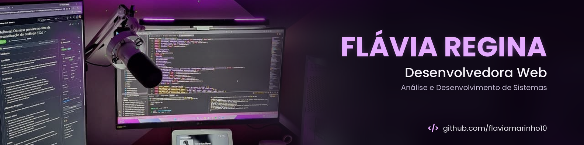

  <a href="https://www.linkedin.com/in/flaviaz">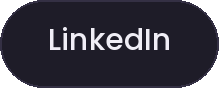</a>
  <a href="mailto:flavinhareginaom@gmail.com">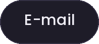</a>
  <a href="https://instagram.com/_flaviamarinhoo">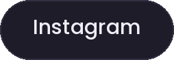</a>

 

  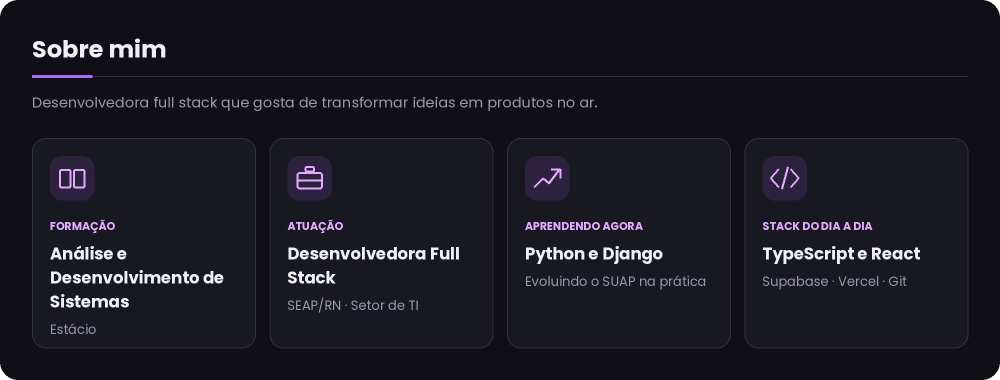

  <a href="https://www.catalogofacil.shop/">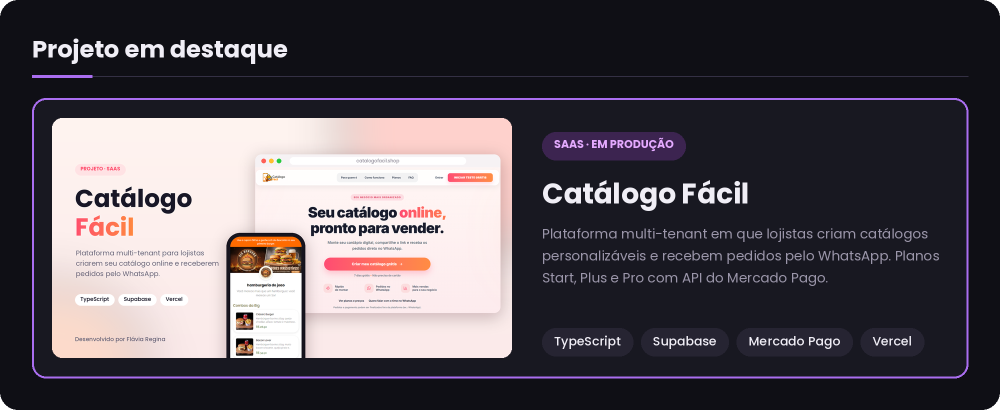</a>

  <a href="https://www.catalogofacil.shop/">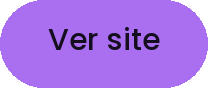</a>

 

  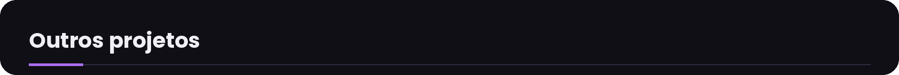

  <a href="LINK_SHINE_GLAM">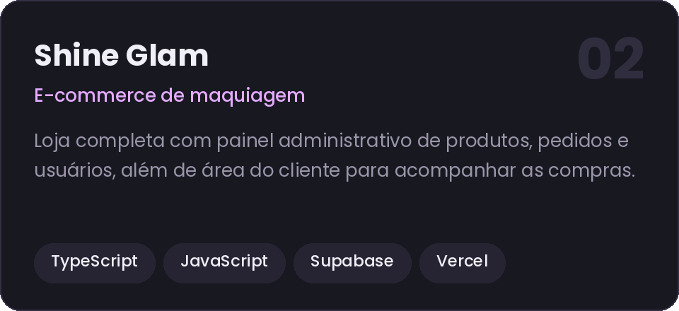</a>
  <a href="LINK_SGMP">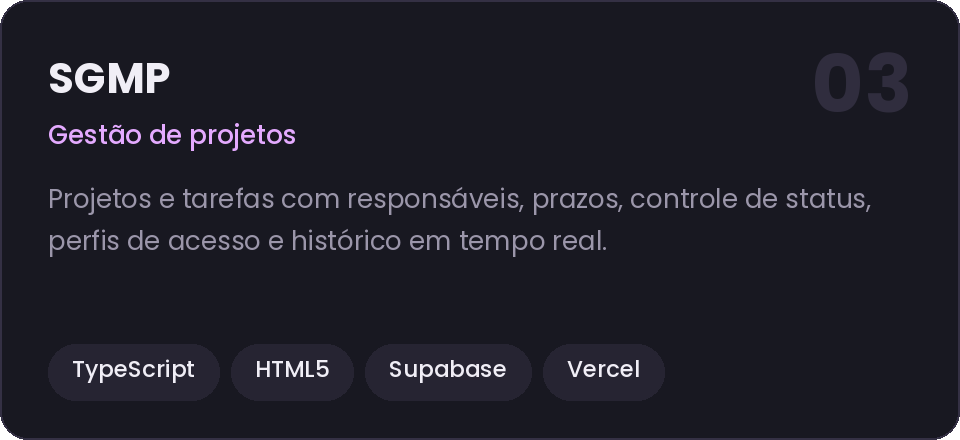</a>

  <a href="LINK_PROTEGE_EDUC">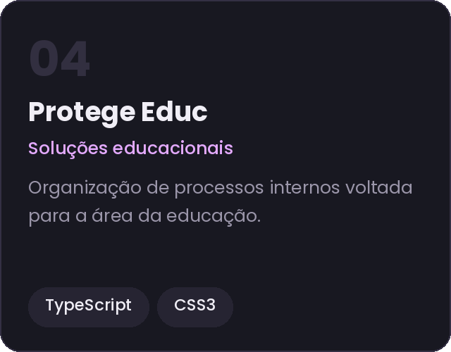</a>
  <a href="LINK_SIMBOX">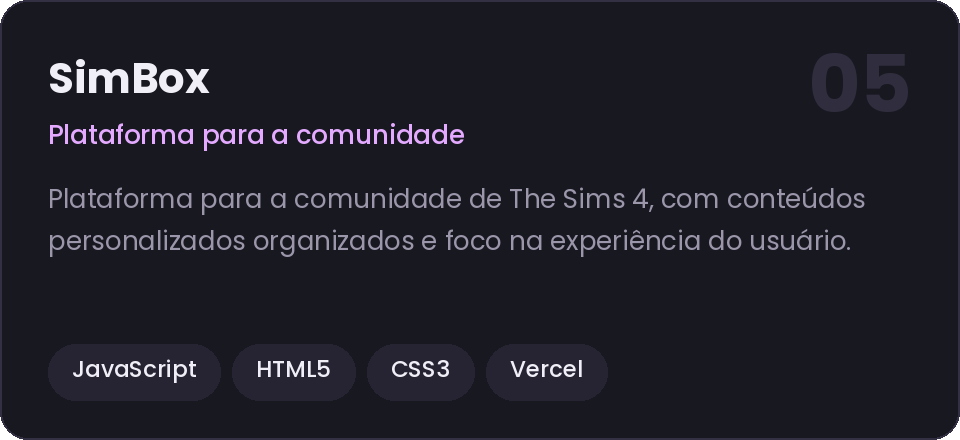</a>

 

  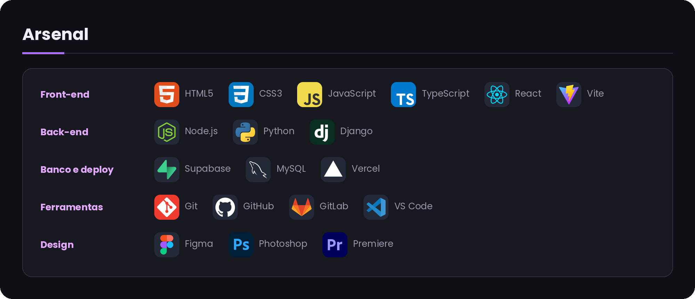

  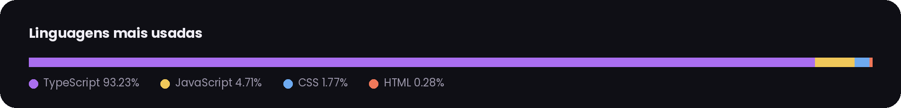

  

