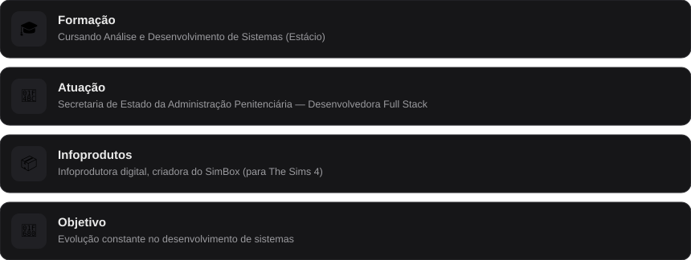
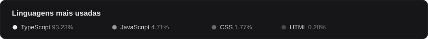

  

   

  

  

    
    &nbsp;
    
  

---

## Sobre mim

  

---

## Projetos

**01 · Shine Glam** — *E-commerce de Maquiagem*
 Site de vendas completo, com painel administrativo para produtos, pedidos e usuários, além de painel do cliente para acompanhamento de compras.
       

 

**02 · Catálogo Fácil** — *SaaS de Catálogos Digitais*
 Plataforma multi-tenant para criação e exibição de catálogos digitais, com planos Free/Pro, pagamento via Karvis PAY e integração com WhatsApp.
     

 

**03 · SGMP** — *Sistema de Gestão e Monitoramento*
 Acompanhamento de projetos e tarefas, com cadastro de responsáveis e prazos, controle de status, perfis de acesso e histórico em tempo real.
      

 

**04 · SimBox** — *Produto Digital*
 Plataforma para a comunidade de The Sims 4, estruturada para apresentação e distribuição de conteúdos personalizados com foco na experiência do usuário.
     

 

**05 · Protege Educ**
 Projeto voltado para soluções educacionais e organização de processos internos.
   

 

**06 · Outros Projetos**
 Aplicações web simples desenvolvidas para estudo, prática e consolidação de conhecimentos.
  

---

## Tecnologias

  

---

## Linguagens

  

 

